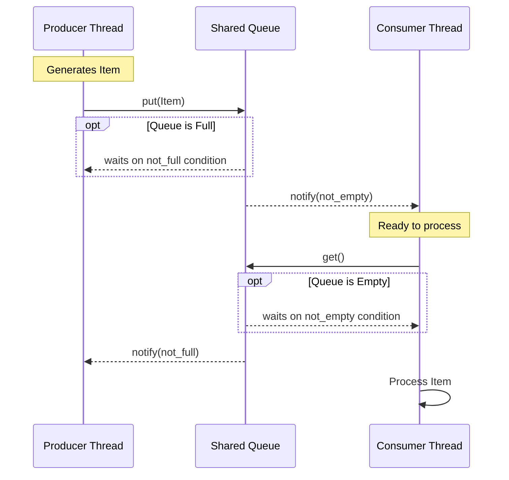

# Assignment 1: Producer-Consumer Pattern Implementation

A Python implementation of the classic **producer-consumer pattern** demonstrating thread synchronization, concurrent programming, blocking queues, and wait/notify mechanisms.

##  Quick Start (Replication Steps)

### Prerequisites
- Python 3.11 or higher
- pip (Python package manager)
- Git (if cloning from repository)

### Step-by-Step Setup

1. **Clone or download the repository**
   ```bash
   git clone <repository-url>
   cd assignment1
   ```
   Or download and extract the project folder.

2. **Create a virtual environment (recommended)**
   ```bash
   # On Windows
   python -m venv venv
   venv\Scripts\activate

   # On Linux/macOS
   python3 -m venv venv
   source venv/bin/activate
   ```

3. **Install dependencies**
   ```bash
   pip install -r requirements.txt
   ```
   This installs:
   - `pytest==7.4.0` - Testing framework
   - `pytest-timeout==2.1.0` - Timeout support for tests

4. **Verify installation**
   ```bash
   python --version  # Should be 3.11 or higher
   pytest --version  # Should show pytest 7.4.0
   ```

### Running the Application

**Command-Line Mode:**
```bash
python -m ProducerConsumer.main --items 100 --capacity 10 --producers 2 --consumers 2
```

Parameters:
- `--items`: Number of work items to generate (1-100000)
- `--capacity`: Shared queue capacity (1-10000)
- `--producers`: Number of producer threads (default 1)
- `--consumers`: Number of consumer threads (default 1)

**Interactive Mode:**
```bash
python -m ProducerConsumer.main
```
Then follow the prompts to enter:
- Number of items to produce (range: 1-100000)
- Queue capacity (range: 1-10000)
- Number of producer threads (range: 1-100)
- Number of consumer threads (range: 1-100)

### Running Tests

**Run all tests:**
```bash
pytest tests/
```

**Run specific test categories:**
```bash
# Assignment 1 tests only
pytest tests/

# Specific test file
pytest tests/test_basic.py

# With verbose output
pytest tests/ -v
```

### Configuring Multiple Producers/Consumers

- Increase `--producers` to fan out creation work while the shared queue enforces backpressure.
- Increase `--consumers` to parallelize consumption; the manager sends one stop signal per consumer.
- The `sequence_number` assigned to every `WorkItem` guarantees that merged results remain in the same order items were generated, regardless of thread interleaving.

### Quick Verification

After setup, verify everything works:
```bash
# Run a quick test
python -m ProducerConsumer.main --items 10 --capacity 3 --producers 2 --consumers 2

# Run all tests
pytest tests/ -v
```

All tests should pass (43 tests total).

### Troubleshooting

- **Python version**: Ensure Python 3.11+ is installed
  ```bash
  python --version
  ```

- **Missing dependencies**: Reinstall requirements
  ```bash
  pip install -r requirements.txt --upgrade
  ```

- **Import errors**: Ensure you're in the project root directory and the virtual environment is activated

---

## 📋 Table of Contents

- [Quick Start](#-quick-start-replication-steps)
- [Overview](#overview)
- [Features](#features)
- [Architecture](#architecture)
- [Installation](#installation)
- [Usage](#usage)
- [How It Works](#how-it-works)
- [Thread Synchronization](#thread-synchronization)
- [Testing](#testing)
- [Project Structure](#project-structure)
- [Requirements](#requirements)

## 🎯 Overview

This project implements a producer-consumer pattern where:
- **Producer thread**: Reads items from a source container and places them into a shared queue
- **Consumer thread**: Reads items from the shared queue and stores them in a destination container
- **Shared Queue**: A thread-safe blocking queue that coordinates communication between threads

The implementation demonstrates:
- ✅ Thread synchronization using Python's `threading` module
- ✅ Concurrent programming with multiple threads
- ✅ Blocking queues with capacity limits
- ✅ Wait/Notify mechanisms (via `queue.Queue`'s internal `threading.Condition`)

## ✨ Features

- **Thread-Safe Operations**: Uses `queue.Queue` for safe concurrent access
- **Blocking Behavior**: Automatically blocks when queue is full/empty
- **Input Validation**: Comprehensive validation with clear error messages
- **Configurable Concurrency**: Supports multiple producer and consumer threads with ordering guarantees
- **Comprehensive Testing**: Unit tests for functional and performance scenarios
- **CLI Interface**: Both command-line and interactive modes
- **Detailed Logging**: Thread-aware logging for debugging concurrent operations
- **Error Handling**: Robust error handling with graceful failure modes

## 🏗️ Architecture

### Execution Flow (Mermaid Diagram)



### Core Components

1. **`Producer`** (`ProducerConsumer/core.py`)
   - Extends `threading.Thread`
   - Reads from source container (list of IDs)
   - Creates `WorkItem` objects and places them in shared queue
   - Blocks when queue is full (via wait/notify mechanism)

2. **`Consumer`** (`ProducerConsumer/core.py`)
   - Extends `threading.Thread`
   - Reads from shared queue
   - Stores items in destination container
   - Blocks when queue is empty (via wait/notify mechanism)

3. **`SimulationManager`** (`ProducerConsumer/core.py`)
   - Orchestrates multiple producer and consumer threads
   - Distributes work evenly, injects STOP signals per consumer, and merges thread-local buffers
   - Validates inputs and handles errors

4. **`WorkItem`** (`ProducerConsumer/models.py`)
   - Immutable data class representing work items
   - Carries a global `sequence_number` to preserve FIFO ordering across multiple producers

### Data Flow

```
Source Container → Producer Thread → Shared Queue → Consumer Thread → Destination Container
     [1,2,3...]      (creates WorkItems)    [Queue]      (processes items)      [WorkItem...]
```

## 📦 Installation

> **Note**: For detailed setup instructions, see the [Quick Start](#-quick-start-replication-steps) section above.

### Prerequisites

- Python 3.11 or higher
- pip (Python package manager)

### Setup

1. Clone or download this repository
2. Install dependencies:

```bash
pip install -r requirements.txt
```

## 🚀 Usage

### Command-Line Mode

Run with command-line arguments:

```bash
python -m ProducerConsumer.main --items 100 --capacity 10
```

**Arguments:**
- `--items`: Number of items to produce (must be > 0)
- `--capacity`: Capacity of the shared queue (must be > 0)

### Interactive Mode

Run without arguments for interactive prompts:

```bash
python -m ProducerConsumer.main
```

You'll be prompted to enter:
- Number of items to produce
- Queue capacity

### Docker

Build and run using Docker:

```bash
docker build -t build-challenge .
docker run -it build-challenge --items 50 --capacity 5
```

## 🔧 How It Works

### Basic Execution Flow

1. **Initialization**: `SimulationManager` creates:
   - Source data (list of item IDs)
   - Shared `queue.Queue` with specified capacity
   - Empty destination list

2. **Thread Creation**: Producer and Consumer threads are created

3. **Concurrent Execution**:
   - Producer starts producing items
   - Consumer starts consuming items
   - Both run concurrently

4. **Synchronization**:
   - If queue is full → Producer blocks (waits)
   - If queue is empty → Consumer blocks (waits)
   - Threads automatically coordinate via queue's internal mechanisms

5. **Completion**:
   - Producer sends `STOP_SIGNAL` when done
   - Consumer processes all items and stops on signal
   - Manager returns results

### Example Output

```
=== Producer-Consumer Simulation ===
2024-01-15 10:30:45 - [Producer] - INFO - Starting
2024-01-15 10:30:45 - [Consumer] - INFO - Starting
2024-01-15 10:30:45 - [Producer] - INFO - Produced WorkItem(id=1)
2024-01-15 10:30:45 - [Consumer] - INFO - Consumed WorkItem(id=1)
...
=== Simulation Complete ===
Items Produced: 100
Items Consumed: 100
SUCCESS: All items processed successfully.
```

## 🔒 Thread Synchronization

### Wait/Notify Mechanism

This implementation uses Python's `queue.Queue`, which internally implements the **wait/notify pattern** using `threading.Condition`:

#### Internal Implementation

`queue.Queue` uses:
- **`threading.Lock`**: Protects the internal data structure
- **`threading.Condition`**: Provides `wait()` and `notify()` methods
  - `not_empty`: Condition for consumers waiting on empty queue
  - `not_full`: Condition for producers waiting on full queue

#### How `queue.put()` Works

1. Acquires internal lock
2. If queue is full → calls `not_full.wait()` (releases lock, blocks thread)
3. When space available → adds item, calls `not_empty.notify()` (wakes consumers)
4. Releases lock

#### How `queue.get()` Works

1. Acquires internal lock
2. If queue is empty → calls `not_empty.wait()` (releases lock, blocks thread)
3. When item available → removes item, calls `not_full.notify()` (wakes producers)
4. Releases lock

This ensures:
- ✅ No race conditions
- ✅ No busy-waiting (efficient CPU usage)
- ✅ Automatic thread coordination
- ✅ Thread-safe operations

### Blocking Behavior

- **Producer blocks** when queue reaches capacity
- **Consumer blocks** when queue is empty
- Threads automatically resume when conditions change
- No manual synchronization code needed

## 🧪 Testing

### Run All Tests

```bash
pytest tests/
```

### Run Specific Test Categories

**Functional Tests:**
```bash
pytest tests/test_functional.py
```

**Performance Tests:**
```bash
pytest tests/test_performance.py
```

### Test Coverage

The test suite includes:

1. **Basic Functionality**
   - Production/consumption matching
   - Data integrity verification

2. **Edge Cases**
   - Small capacity (capacity=1) forcing frequent blocking
   - Input validation (zero, negative, invalid types)

3. **Performance**
   - Large dataset processing (1000 items)
   - Timeout detection for deadlocks

### Example Test Output

```bash
$ pytest tests/ -v
======================== test session starts ========================
tests/test_functional.py::test_basic_production_consumption PASSED
tests/test_functional.py::test_small_capacity_blocking PASSED
tests/test_functional.py::test_zero_capacity_error PASSED
tests/test_performance.py::test_performance_large_dataset PASSED
======================= 4 passed in 0.15s ========================
```

## 📁 Project Structure

```
ProducerConsumer/
├── ProducerConsumer/               # Assignment 1: Producer-Consumer Pattern
│   ├── __init__.py            # Package initialization
│   ├── main.py                # Entry point
│   ├── core.py                # Core implementation (Producer, Consumer, SimulationManager)
│   ├── models.py              # Data models (WorkItem)
│   ├── cli.py                 # Command-line interface
│   ├── utils.py               # Utility functions (logging setup)
│   └── README.md              # Assignment 1 documentation
├── tests/                     # Test suite
│   ├── ProducerConsumer/           # Assignment 1 tests (8 test files)
│   │   ├── test_basic.py
│   │   ├── test_workitem.py
│   │   ├── test_validation.py
│   │   ├── test_edgecases.py
│   │   ├── test_dataIntegrity.py
│   │   ├── test_threadBehaviour.py
│   │   ├── test_bufferState.py
│   │   └── test_performance.py
├── .github/
│   └── workflows/
│       └── ci.yaml            # CI/CD pipeline
├── Dockerfile                 # Docker configuration
├── requirements.txt           # Python dependencies
├── pytest.ini                 # Pytest configuration
└── README.md                  # This file
```

## 📚 Requirements

### Python Dependencies

- `pytest==7.4.0` - Testing framework
- `pytest-timeout==2.1.0` - Timeout support for tests

### System Requirements

- Python 3.11+
- Operating System: Windows, Linux, or macOS

## 🎓 Educational Value

This implementation demonstrates:

1. **Concurrent Programming**: Multiple threads working together
2. **Thread Synchronization**: Coordinating access to shared resources
3. **Blocking Queues**: Efficient thread communication
4. **Wait/Notify Pattern**: Classic synchronization mechanism
5. **Thread Safety**: Immutable data structures and safe concurrent access

## 🔍 Code Quality

- ✅ Comprehensive input validation
- ✅ Detailed error handling
- ✅ Extensive code comments explaining synchronization
- ✅ Type hints for better code clarity
- ✅ Docstrings for all classes and methods
- ✅ CI/CD pipeline with automated testing

## 📝 License

This project is provided as an educational example of the producer-consumer pattern implementation.

## 🤝 Contributing

This is an educational project. Feel free to:
- Study the code to understand thread synchronization
- Modify parameters to experiment with different scenarios
- Add additional tests or features
- Use as a reference for your own implementations

## 📖 Additional Resources

- [Python threading documentation](https://docs.python.org/3/library/threading.html)
- [Python queue documentation](https://docs.python.org/3/library/queue.html)
- [Producer-Consumer Problem](https://en.wikipedia.org/wiki/Producer%E2%80%93consumer_problem)

---

**Note**: This implementation uses `queue.Queue` which abstracts away the low-level wait/notify mechanisms. The code includes detailed comments explaining how these mechanisms work internally. For educational purposes, you could also implement a custom bounded buffer using `threading.Condition` directly to see the wait/notify pattern more explicitly.

