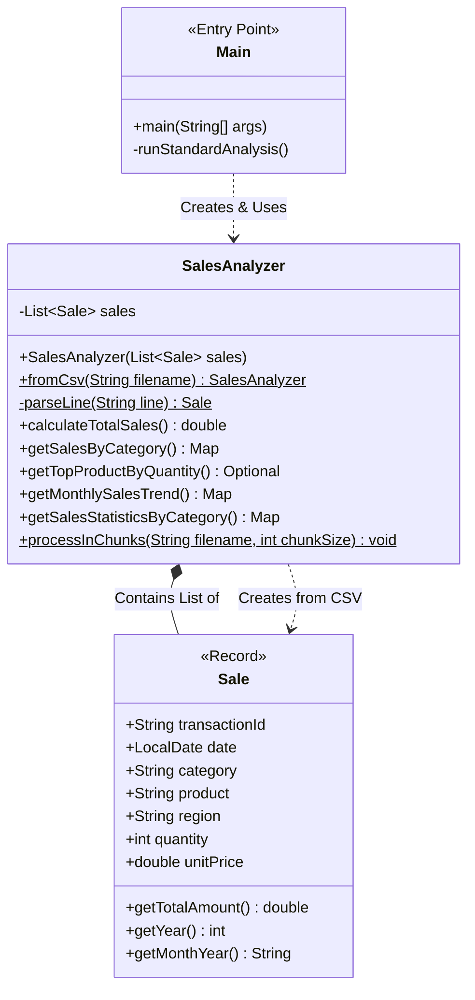

# Assignment 2: Sales Data Analyzer (Java)

A Java-based data analysis tool that processes sales records from CSV files using **Functional Programming** paradigms, the **Streams API**, and robust **Object-Oriented Design**.

## Quick Start (Replication Steps)

### Prerequisites
- Java 17 or higher (Required for `record` support)
- Maven (for dependency management)
- Git

### Step-by-Step Setup

1. **Clone the repository**
   ```bash
   git clone <repository-url>
   cd assignment2
   ```

2. **Build the project**
   ```bash
   mvn clean install
   ```
   This compiles the code and runs all unit tests.

### Running the Application

**Interactive Mode:**
```bash
mvn exec:java -Dexec.mainClass="com.assignment2.Main"
```
You will be prompted to choose between:
1. **Standard Analysis**: Loads all data into memory using Streams (Best for small-medium files).
2. **Batch Processing**: Processes data in chunks (Best for massive files simulating Big Data).

**Automated Mode (Chunking):**
You can pass arguments directly to simulate an automated pipeline:
```bash
# Run chunked processing with a batch size of 500
mvn exec:java -Dexec.mainClass="com.assignment2.Main" -Dexec.args="500"
```

### Running Tests

```bash
mvn test
```

---

## 🎯 Overview

This assignment demonstrates proficiency in modern Java development by building a tool that analyzes sales data. The core objectives are:

1. **Functional Programming**: Using Lambda expressions and Method References.
2. **Stream Operations**: Performing complex aggregations (Filter, Map, Reduce) declaratively.
3. **Data Aggregation**: Grouping data by Region, Category, and Time.
4. **Scalability**: Implementing a "Chunking" mechanism to handle datasets larger than available RAM.

## ✨ Features

- **Immutability**: Uses Java `record` for the `Sale` data carrier, ensuring thread safety and data purity.
- **Declarative Analysis**: All major aggregations (Sum, Average, Count) are performed using the Stream API.
- **Robust Error Handling**: Includes fault tolerance for file I/O and batch processing retries.
- **Scalable Architecture**: Supports both in-memory analysis and chunk-based processing for large files.
- **Comprehensive Reporting**: Outputs detailed statistics including:
    - Total Revenue
    - Sales by Category & Region
    - Top Selling Products
    - Monthly & Yearly Trends
    - Min/Max/Average Statistics

## 🏗️ Architecture

### Class Structure Diagram



### Component Breakdown

1. **`Sale.java` (The Data)**
   - Implemented as a Java `record`.
   - Immutable data carrier for transaction details.
   - Includes helper methods for derived properties like `getTotalAmount()`.

2. **`SalesAnalyzer.java` (The Logic)**
   - The core engine containing all business logic.
   - **Stream API**: Used for in-memory aggregations (`groupingBy`, `summingDouble`, `summarizingDouble`).
   - **Chunking Engine**: A static method `processInChunks` that manually manages memory to process huge files.

3. **`Main.java` (The Controller)**
   - Handles user interaction and argument parsing.
   - Selects the execution strategy (Standard vs. Batch) based on user input.

## 📦 Project Structure

```
assignment2/
├── src/
│   ├── main/
│   │   ├── java/com/assignment2/
│   │   │   ├── Main.java           # Entry Point
│   │   │   ├── Sale.java           # Data Record
│   │   │   └── SalesAnalyzer.java  # Core Logic
│   │   └── resources/
│   │       └── sales_data.csv      # Sample Dataset
│   └── test/
│       └── java/com/assignment2/
│           ├── MainTest.java           # Logic Tests
│           ├── SalesAnalyzerTest.java  # Analysis Tests
│           └── ChunkingTest.java       # Scalability Tests
├── pom.xml                         # Maven Configuration
└── README.md                       # This File
```

## 🔍 Key Concepts Demonstrated

### 1. Functional Programming
Instead of imperative loops (`for (int i=0...)`), we use declarative streams:
```java
// Imperative
double sum = 0;
for(Sale s : sales) sum += s.getTotalAmount();

// Functional
double sum = sales.stream().mapToDouble(Sale::getTotalAmount).sum();
```

### 2. Advanced Collectors
The project uses `Collectors.groupingBy` combined with downstream collectors like `summingDouble` and `summarizingDouble` to perform SQL-like aggregations in Java.

### 3. Separation of Concerns
- **I/O Logic**: Isolated in `fromCsv`.
- **Business Logic**: Isolated in `SalesAnalyzer`.
- **Control Logic**: Isolated in `Main`.

## 🧪 Testing

The project includes a comprehensive JUnit 5 test suite:

1. **`SalesAnalyzerTest`**: Verifies all functional requirements (Total Sales, Top Products, Grouping).
2. **`ChunkingTest`**: Validates the scalability logic by processing data in small batches.
3. **`MainTest`**: Ensures the application entry point handles arguments correctly.

Run tests with:
```bash
mvn test
```

## 📝 License

Educational Project - Open Source.
