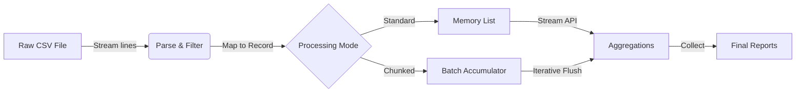

# Assignment 2: Sales Data Analysis with Java Streams

## Overview
This application performs data analysis on a CSV dataset of sales transactions. It demonstrates proficiency with **Java Streams**, **Functional Programming**, and **Data Aggregation** techniques. The program reads a CSV file, parses it into objects, and executes various analytical queries such as calculating total revenue, finding top-selling products, and grouping sales by region and category.

## Features & Stream Operations

### Data Flow Pipeline



The solution implements the following functional operations:
*   **Filtering & Mapping**: Parsing raw CSV lines into `Sale` objects (`map`), filtering empty lines.
*   **Aggregation**: Calculating total sales (`mapToDouble`, `sum`).
*   **Grouping**: Grouping data by Category or Region (`collect`, `groupingBy`).
*   **Statistical Analysis**: Finding detailed stats (Min, Max, Avg) (`summarizingDouble`).
*   **Temporal Analysis**: Trending sales by month (`groupingBy` date fields).
*   **Partitioning**: Splitting orders by value threshold (`partitioningBy`).
*   **Scale**: Supports chunked processing for large files.

### Dataset Schema
| Field | Type | Description | Example |
| :--- | :--- | :--- | :--- |
| **TransactionId** | String | Unique identifier for the sale | `T00001` |
| **Date** | LocalDate | Date of the transaction (YYYY-MM-DD) | `2024-01-15` |
| **Category** | String | Product category group | `Electronics` |
| **Product** | String | Specific item name | `Laptop` |
| **Region** | String | Geographic location of sale | `North` |
| **Quantity** | Integer | Number of units sold | `2` |
| **UnitPrice** | Double | Price per single unit | `1200.00` |

## Project Structure
```
assignment2/
├── pom.xml                  # Maven build configuration
├── README.md                # This file
├── src/
│   ├── main/
│   │   ├── java/
│   │   │   └── com/assignment2/
│   │   │       ├── Main.java            # Entry point (Console output)
│   │   │       ├── Sale.java            # Immutable Data Model (Java Record)
│   │   │       └── SalesAnalyzer.java   # Core Logic (Stream operations)
│   │   └── resources/
│   │       └── sales_data.csv       # Dataset
│   └── test/
│       ├── README.md                # Test documentation
│       └── java/
│           └── com/assignment2/
│               └── SalesAnalyzerTest.java # JUnit 5 Tests
```

## Setup & Execution

### Prerequisites
*   Java 17 or higher

### Option 1: Running with Maven (Recommended)
1.  Navigate to the `assignment2` directory:
    ```bash
    cd assignment2
    ```
2.  Compile and run:
    ```bash
    mvn clean compile exec:java "-Dexec.mainClass=com.assignment2.Main"
    ```
3.  Run tests:
    ```bash
    mvn test
    ```

### Option 2: Running Manually (Without Maven)
If Maven is not installed, you can compile and run using standard Java commands:

**Windows (PowerShell):**
```powershell
# 1. Create bin directory
mkdir assignment2/bin

# 2. Compile source files
javac -d assignment2/bin assignment2/src/main/java/com/assignment2/*.java

# 3. Copy resource file to bin (classpath root)
copy assignment2/src/main/resources/sales_data.csv assignment2/bin/sales_data.csv

# 4. Run the application
java -cp assignment2/bin com.assignment2.Main
```

### Option 3: Running Tests Manually (Without JUnit/Maven)
If you do not have Maven or JUnit libraries installed, you can run the provided `ManualTest` script which performs the same verifications using pure Java:

```powershell
# Compile the manual test script
javac -d assignment2/bin assignment2/src/main/java/com/assignment2/*.java assignment2/src/test/java/com/assignment2/ManualTest.java

# Run the test script
java -cp assignment2/bin com.assignment2.ManualTest
```

### Option 4: Running with Docker (Zero Dependencies)
This ensures the application runs in a completely isolated environment. The Docker build process automatically executes all unit tests before creating the image.

1.  **Build the Docker Image**:
    ```bash
    cd assignment2
    docker build -t sales-analyzer .
    ```
    *(Note: This step runs `mvn test` internally. If tests fail, the build will fail.)*

2.  **Run the Application**:
    ```bash
    docker run --rm sales-analyzer
    ```

## Design Choices & Assumptions

### 1. Data Representation: Java Records
I chose **Java Records** (`record Sale(...)`) for the data model because:
*   **Immutability**: Fits the functional programming paradigm perfectly.
*   **Conciseness**: Eliminates boilerplate (getters, setters, constructors, `toString`, `equals`).
*   **Readability**: Makes the data structure clear and simple.

### 2. CSV Parsing: Native Streams
Instead of using an external library like OpenCSV, I implemented a custom parser using `BufferedReader.lines()` and Java Streams.
*   **Reasoning**: This explicitly fulfills the requirement to demonstrate "Stream operations" and "Functional programming" even during the data loading phase.
*   **Assumption**: The CSV format is simple (no commas inside fields). Code handles empty trailing lines gracefully.

### 3. Dataset Selection
I constructed a custom `sales_data.csv` containing ~20,000 transactions with fields: `TransactionId`, `Date`, `Category`, `Product`, `Region`, `Quantity`, `UnitPrice`.
*   **Why**: This large schema supports multi-dimensional aggregation (Category, Region, Time) and meaningful performance testing for the chunking feature.

### 4. Advanced Feature: Chunked Processing
To support large-scale data processing (e.g., files larger than available RAM), the application includes a `processInChunks` method.
*   **Architecture**: It reads the file using a lazy iterator, accumulating a fixed number of records (chunk size) into memory.
*   **Accumulation**: Each chunk updates a set of global counters/sums.
*   **Retry Logic**: If a chunk fails to process, the system attempts to retry before skipping, simulating fault-tolerant batch processing.

## Sample Output
```text
--- Loading Sales Data ---
Loaded 20000 sales records.

=====================================
       SALES DATA ANALYSIS
=====================================

1. Total Sales Revenue:
   $110,407,964.25

2. Total Sales by Category:
   Clothing: $22,685,861.13
   Electronics: $22,412,091.25
   ...

7. Detailed Statistics by Category (NEW):
   Clothing:
      Count: 4062, Min: $20.05, Max: $19,985.10, Avg: $5,584.90
   ...

8. Monthly Sales Trend (NEW):
   2024-01: $9,494,647.62
   2024-02: $8,408,740.30
   ...
```
